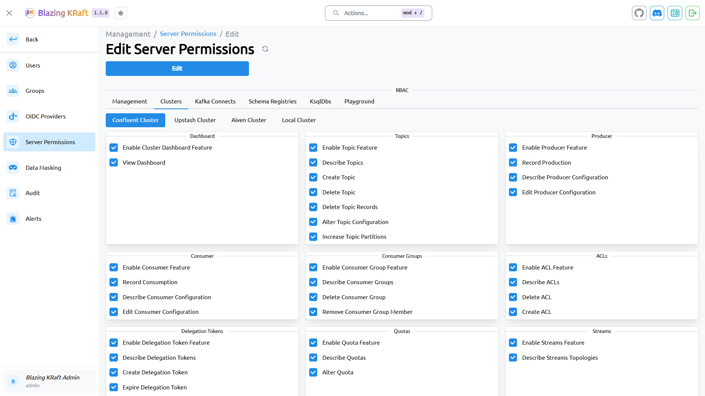
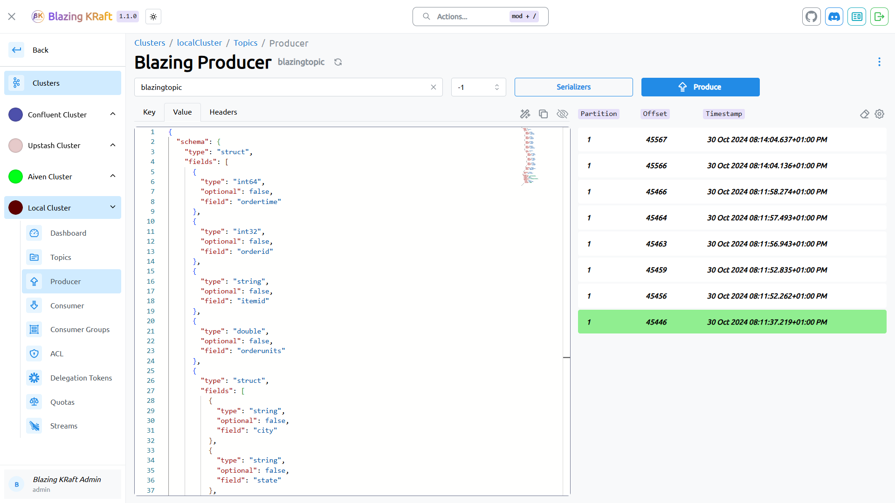
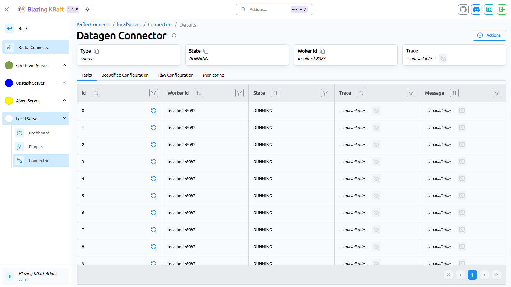
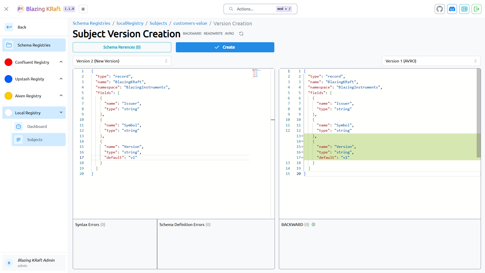
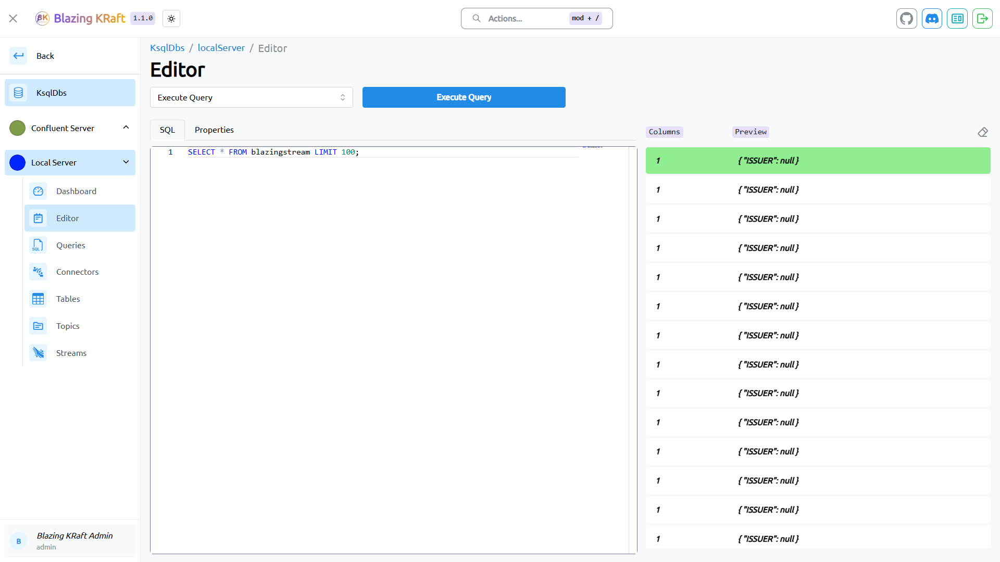

# Blazing KRaft

Blazing KRaft is an all in one GUI that covers practically all features of every single component in the Apache Kafka® ecosystem.

## Links

- [Documentation](https://www.blazingkraft.com/)
- [Ask question or give feedback](https://github.com/redadani1997/blazingkraft/issues)
- [Join Discord community](https://discord.gg/mWhWshHMAz)

## Features

- [`Management`](https://www.blazingkraft.com/docs/management/users) – Governing your users and their granular access to the platform has never been easier.

- [`Cluster`](https://www.blazingkraft.com/docs/cluster/clusters) – Exploring your data with game changing capabilities through a polished UI.

- [`Kafka Connect`](https://www.blazingkraft.com/docs/kafka-connect/kafka-connects) – Having your plugins, connectors and tasks one click away.

- [`Schema Registry`](https://www.blazingkraft.com/docs/schema-registry/schema-registries) – Making the most value out of your schemas with the registry intergration.

- [`KsqlDb`](https://www.blazingkraft.com/docs/ksqldb/ksqldbs) – Interacting with your queries in the most optimal way.

- [`Playground`](https://www.blazingkraft.com/docs/playground/schemas-content) – Having an all in one validation and conversion utility.

## Getting started

Blazing KRaft is _**FREE**_ and It's super easy to get started with it, just follow the simple steps [described here](https://www.blazingkraft.com/).